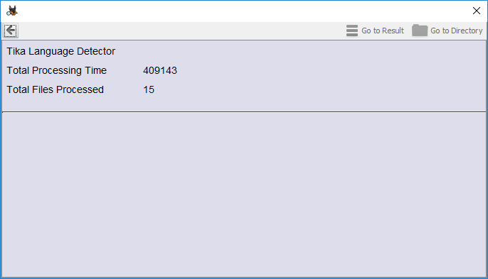

# Tika Language Detector File Ingest Module
Autopsy File Ingest Module that uses Tika to detect the language of common file
documents.

## Files types supported
Currently programmed to try and process files with the following extensions:
* .doc
* .docx
* .xls
* .xlsx
* .ppt
* .pptx
* .pdf

## Languages supported by Tika models:
||||
--- | --- | --- | ---
Belarusian| Catalan|Danish| German
Esperanto|Estonian|Greek|English
Spanish|Finnish|French|Persian
Galician|Hungarian|Icelandic|Italian
Lithuanian|Dutch|Norwegian|Polish
Portuguese|Romanian|Russian|Slovakian
Slovenian|Swedish|Thai|sUkrainian

[tika.language.properties](https://github.com/apache/tika/blob/master/tika-core/src/main/resources/org/apache/tika/language/tika.language.properties)

## Example Autopsy Results
### Interesting File Hits

Results are displayed as **Interesting Items** with a sub-category of *Language_Detected*

### Ingest Summary Overview

Tika Langue Detector reports processing summary results similar to other Plugins.

Once an ingestion is complete, the total processing time and number of files
processed is reported.

## Example Results from nps-2008-jean.E01

